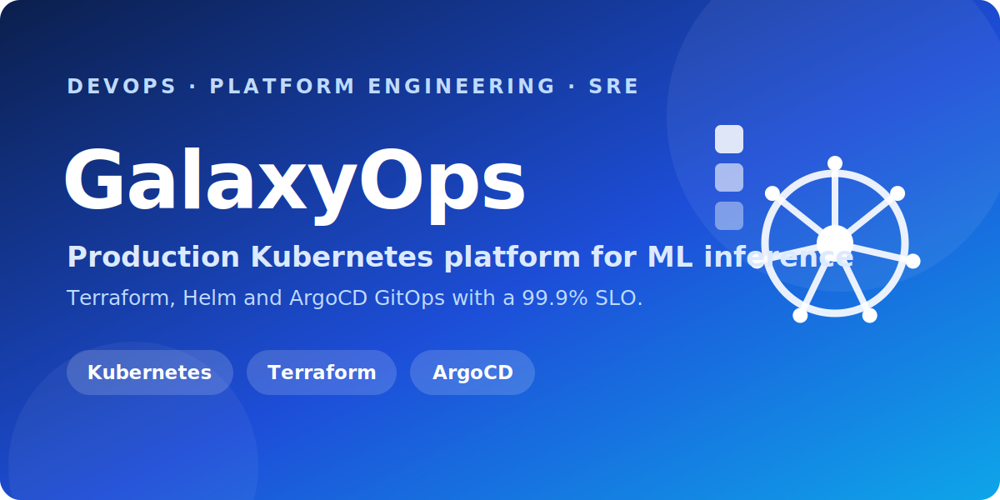
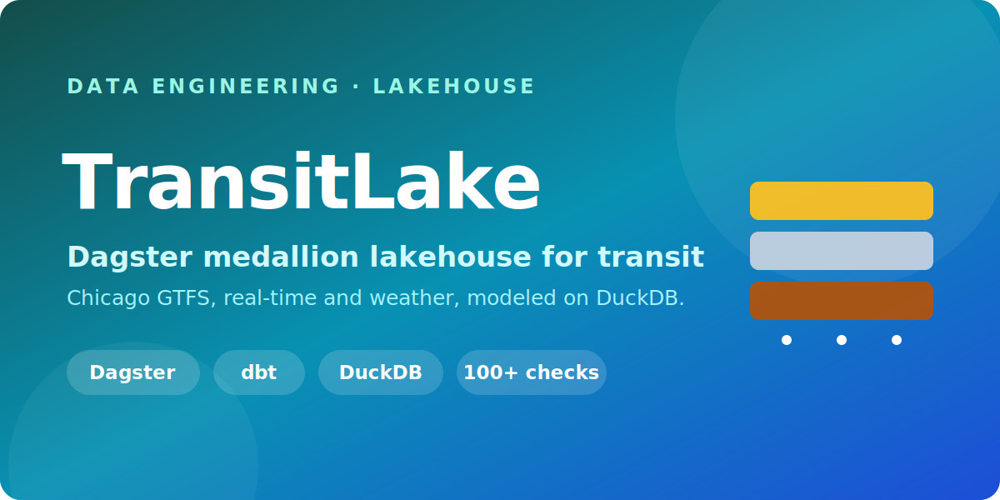
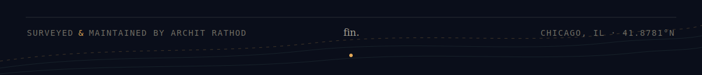

## 01 · The brief

I build systems that are **measurably correct** and **demonstrably fair**, from OpenStreetMap road closures at city scale to fairness auditing for deep models.

&nbsp;&nbsp;**▸ Shipped** a Google Summer of Code API, now used by the **OpenStreetMap** community 
&nbsp;&nbsp;**▸ Built** the first **GitLab Duo Agent** on Green Software Foundation standards 
&nbsp;&nbsp;**▸ Engineered** freight-data pipelines covering **285+ Chicago municipalities** 
&nbsp;&nbsp;**▸ Published** at **ASE 2026**, a **NeurIPS 2023** workshop, and **Springer ×2**

> Hiring for 2026? &nbsp;[**Start a conversation ↗**](https://architr.vercel.app/#contact)

---

## 02 · Current waypoints

- **TaxMR** at UIC's RISC Lab: a metamorphic robustness benchmark for tax-answering LLMs, as ML research engineer under Prof. Saeid Tizpaz-Niari.
- **Freight Toolkit** at UIC's Urban Transportation Center: freight analytics for 285+ municipalities.
- **Google Summer of Code 2025**, completed: a road-closures API adopted by the OpenStreetMap Foundation.
- **Production ML**: GalaxyServe (MLOps), GalaxyOps (Kubernetes GitOps), TransitLake (Dagster lakehouse).
- **FairLint-DL**, accepted at **ASE 2026**: fairness debugging inside VS Code.

---

## 03 · The instruments

  

<b>Every instrument, by category</b> &nbsp;

 

**Languages**

**Machine Learning & Data**

**Frameworks & Tools**

**Cloud & DevOps**

-172033?style=flat-square&logo=githubactions&logoColor=EAE7DB)

**Databases**

**Geospatial**

## 04 · Selected work

> The flagships. 40+ more are charted in the archive below.

<table>
<tr>
<td width="50%" valign="top">

 

</td>
<td width="50%" valign="top">

 

</td>
</tr>
<tr>
<td width="50%" valign="top">

 

</td>
<td width="50%" valign="top">

 

</td>
</tr>
<tr>
<td width="50%" valign="top">

 

</td>
<td width="50%" valign="top">

 

</td>
</tr>
<tr>
<td width="50%" valign="top">

 

</td>
<td width="50%" valign="top">

 

</td>
</tr>
</table>

---

## 05 · The full archive

<b>AI Agents and Skills</b> &nbsp;

 

| Agent / Skill Set | What it is                                                                                                                                                                | Repo                                                |
| ----------------- | ------------------------------------------------------------------------------------------------------------------------------------------------------------------------- | :-------------------------------------------------: |
| FairGuard         | Reusable Claude Code Agent Skills for investigative journalism, plus findings on 1M+ federal lobbying records and congressional press releases (2022-Q1 2026). Northwestern GAIN Challenge. |  |
| Lattice           | AI-native venture-intelligence platform: a multi-agent LangGraph and Neo4j institutional-memory layer that extracts relationship graphs and semantic memory for VC firms. |  |

<b>Engineering and Platforms (MLOps · DevOps · Data)</b> &nbsp;

 

| Project | What it is | Stack | Links |
| ------- | ---------- | ----- | :---: |
| **GalaxyServe** | Production MLOps loop for a galaxy classifier: FastAPI serving, MLflow registry, Evidently drift detection, Prometheus/Grafana, and CI-gated champion/challenger retraining. | PyTorch, FastAPI, MLflow, Evidently |  |
| **GalaxyOps** | Production-grade Kubernetes platform: Terraform + Helm + ArgoCD GitOps with kube-prometheus-stack, HPA autoscaling, chaos testing, and a 99.9% availability SLO. | Kubernetes, Terraform, Helm, ArgoCD |  |
| **TransitLake** | Dagster medallion lakehouse for Chicago transit: GTFS, real-time vehicle positions, congestion, and weather into dbt models on DuckDB with 100+ data-quality checks. | Dagster, dbt, DuckDB, Great Expectations |   |
| **CryptoNorm** | Real-time crypto market-data normalizer and P&L/risk dashboard: async multi-exchange WebSocket ingestion normalized through Kafka with a Redis state cache. | Python asyncio, Kafka, Redis, FastAPI |  |

<b>Urban Analytics and Geospatial</b> &nbsp;

 

| Project | What it is | Stack | Links |
| ------- | ---------- | ----- | :---: |
| **Freight Toolkit** | CMAP regional freight analytics dashboard across 285+ Chicago municipalities (truck traffic, land use, crashes, emissions). UIC Urban Transportation Center, FTA FERSC initiative. | Next.js, FastAPI, MapLibre GL, PostgreSQL, Shapely |  |
| **Optimal Congestion Zone Analysis** | Framework for optimal congestion-pricing zone boundaries via OSM road networks, origin-destination trip flows, and graph-theory cut-edge optimization. UIC. | Python, OSMnx, NetworkX, GeoPandas |   |

<b>Research and Data Mining</b> &nbsp;

 

| Project | What it is | Stack | Links |
| ------- | ---------- | ----- | :---: |
| **Galaxy Morphology XAI** | Systematic evaluation of Grad-CAM, LIME, Integrated Gradients, and GradientSHAP across four CNN architectures on galaxy datasets, using quantitative faithfulness metrics. | PyTorch, Captum, LIME, scikit-learn |  |
| **FairLend Miners** | PySpark data-mining audit of racial and gender disparities in HMDA 2023 mortgage lending: standard vs epsilon-biased fair binning with FP-Growth and K-Means. | PySpark, FP-Growth, K-Means, Parquet |   |

<b>Open Source</b> &nbsp;

 

| Web / App                                |                 Demo                  |                              Contribute                              |
| ---------------------------------------- | :-----------------------------------: | :------------------------------------------------------------------: |
| Green Pipe                               |                  -                |                      |
| FairLint-DL VSCode Extension             ||   |
| Temporary Road Closures API and Database |        |  |
| DSAverse                                 |  |                        |
| DSA-30                                   |      |                  |

<b>AI / ML Web Apps</b> &nbsp;

 

| Web App              | Front End             | Back End (Server / Database)                  | ML (Model / Dataset / Library)                              |                    Live Demo                    |                           Repo                           |
| -------------------- | --------------------- | --------------------------------------------- | ----------------------------------------------------------- | :-----------------------------------------------: | :-----------------------------------------------------: |
| The After            | Next.js 16, Tailwind CSS v4 | Supabase (Postgres, Auth, Storage), Zod  | OpenAI GPT-5.6 with deterministic demo fallback             |          |    |
| Real Estate AI       | Next.js, Tailwind CSS | Fast API, SerpAPI, Zillow API, Google Cloud Run | Hugging Face, OpenAI                                      |          |    |
| Multi Document Agent | Next.js, Tailwind CSS | Fast API                                      | Llama Index, OpenAI                                         |        |    |
| FitSphere            | Next.js, Tailwind CSS | Fast API, MongoDB, Node.js                    | OpenCV, OpenAI                                              |                |            |
| Ascend AI            | Next.js, Tailwind CSS | Fast API, MongoDB                             | OpenCV, Transformers, OpenAI, Librosa                       |            |             |
| PhishiFence          | Next.js, Tailwind CSS | Fast API, WhoisDB, Chrome Extension, Selenium | OpenCV, Transformers, OpenAI, LightGBM                      |               |         |
| SwarBhaav            | Next.js, Tailwind CSS | MongoDB, Fast API, Node.js                    | Librosa, Transformers, OpenAI                               |                |            |
| Attire AI            | Next.js, Tailwind CSS | Flask                                         | Langchain, Stable Diffusion, NLTK, Llama                    |                |            |
| Reflections          | Next.js, Tailwind CSS | MongoDB, Fast API, Prisma                     | BERT, NLP, Recommender, Summarizer                          |       |  |
| Home Ginie           | Next.js, Tailwind CSS | Fast API                                      | Linear Regressor, US Housing Dataset                        |               |         |
| The One Finder       | Next.js, Tailwind CSS | MongoDB, Fast API, Node.js                    | Recommender                                                 |         |     |
| Social Vision        | Next.js, Tailwind CSS | MongoDB, Fast API                             | Recommender, WordCloud, Sentiment Analysis, Twitter Dataset |  |       |

<b>Web Projects</b> &nbsp;

 

| Web App                 | Front End                              | Back End                              |                           Live Demo                           |                                 Repo                                 |
| ----------------------- | -------------------------------------- | ------------------------------------- | :----------------------------------------------------------: | :---------------------------------------------------------------------: |
| Chatzy                  | Next.js, Tailwind CSS, Typescript      | Express.js, Node.js, DiceBear API     |                        |                               |
| RealEstate360           | Next.js, Tailwind CSS, Grunt, Three.js | MongoDB, Cloudinary, Node.js, FastAPI |                     |                        |
| Bid Bazaar              | Next.js, Tailwind CSS                  | MongoDB, Cloudinary, Node.js, Flask   |                          |                     |
| Coupon Vault            | Next.js, Tailwind CSS                  | MongoDB, Fast API, Node.js            |                        |                         |
| Power Up                | React, Tailwind CSS                    | Node.js, MongoDB, API's               |                        |                              |
| First Paper             | Next.js, Tailwind CSS                  | ArXiv Dataset                         |                         |                          |
| Moviescape              | React, Tailwind CSS                    | TMDB                                  |                         |                            |
| Edu-Sys                 | React, Tailwind CSS                    | Node.js, MongoDB                      |                         |                    |
| Healthy Me!             | React, Tailwind CSS                    | Node JS, MongoDB                      |                              -                               |  |
| To Do App               | React, CSS                             | Node.js, MongoDB                      |            |                             |
| Emoji Nation            | React, CSS                             | API                                   |                     |                         |
| Daily Newsletter Signup | HTML, CSS, Bootstrap, JS               | Node.js                               |            |            |
| Personal Blog           | HTML, CSS, JS                          | Node.js (Express, EJS)                |            |                        |
| Weather Today           | HTML, CSS, JS                          | Node.js                               |            |                        |
| Simon Game              | HTML, CSS, JS                          | -                                     |            |                     |
| Image Gallery App       | HTML, CSS, JS                          | LocalStorage                          |                |                  |
| Random Quote Generator  | HTML, CSS, JS                          | -                                     |  |             |
| Simple Calculator       | HTML, CSS, JS, jQuery                  | -                                     |       |                  |

<b>Python Projects</b> &nbsp;

 

| Python App               | Concept / Libraries Used |                                Demo                                |                                Repo                                |
| ------------------------ | ------------------------ | :----------------------------------------------------------------: | :--------------------------------------------------------------------: |
| Background Image Remover | Flask, HTML, Rembg       |                                -                               |                          |
| Cold Emailing            | Flask, HTML              |                |                     |
| GRE Words App            | OOPS, Pandas, Tkinter    |        |                |
| Pong Game                | OOPS, Tkinter            |                 |                           |
| Indian States Game       | Tkinter, Pandas          |         |                 |
| Snake Game               | OOPS, Tkinter            |                |                           |
| Pomodoro Technique Timer | Tkinter                  |  |            |
| Proctor It!              | OpenCV, Tkinter, MySQL   |                                 -                                  |  |
| Mail Merger              | File Handling            |                              -                              |                         |
| NATO Alphabet Generator  | Pandas                   |                                 -                                  |            |
| Hirst Painting           | Tkinter                  |            |                    |

<b>Java Project</b> &nbsp;

 

| Desktop App                | Concept / Libraries Used |                                        Repo                                        |
| -------------------------- | ------------------------ | :--------------------------------------------------------------------------------: |
| Electricity Billing System | Java Swing               |  |

> [!NOTE]
> Some older demos have retired backends; the code tells the full story.

## 06 · Research & publications

9 papers and reports; peer-reviewed at **ASE 2026**, **NeurIPS 2023**, and **Springer ×2**.

| Publication | Venue | Year | Links |
| ----------- | ----- | :--: | :---: |
| **FairLint-DL: An IDE-Native Tool for Fairness Debugging of Deep Learning Software** | ASE 2026 (accepted) | 2026 |   |
| **Auditing Discriminatory Patterns in Mortgage Lending Through Association Rules and Fair Binning** | arXiv · cs.CY / cs.DB / cs.LG | 2026 |  |
| **Responsible AI for Scientific Discovery: Explainability for Galaxy Morphology Classification** | UIC Technical Report (submitted to SKAI 2026) | 2026 | |
| **Measuring and Mitigating Toxicity in Large Language Models: A Comprehensive Replication Study** | UIC Technical Report | 2025 |  |
| **Coordinated Amplification and Misinformation Detection in Global YouTube Conflict Narratives** | UIC · CS 418 | 2025 | |
| **Benchmarking Algorithms for Heterogeneous Treatment Effect Estimation in Networks** | UIC Technical Report | 2024 | |
| **Ascend.AI: Facial Expression, Tone, and Pitch Analysis with Chatbot Guidance** | ICDSA 2024 · Springer (peer-reviewed) | 2024 |  |
| **Multiagent Simulators for Social Networks** | NeurIPS 2023 · MASec Workshop (peer-reviewed) | 2023 |  |
| **Leveraging CNNs and Ensemble Learning for Automated Disaster Image Classification** | ICSISCET 2023 · Springer (peer-reviewed) | 2023 |  |

## 07 · Education

| Institution | Degree | Period | Highlights |
| ----------- | ------ | ------ | ---------- |
| **University of Illinois Chicago** | M.S. Computer Science | Aug 2024 - May 2026 | GPA 3.7 / 4.0 · NLP, Data Science, Algorithmic Fairness, Responsible AI |
| **University of Mumbai** (Thadomal Shahani Engineering College) | B.E. Information Technology | Feb 2021 - May 2024 | CGPA 9.32 / 10 · DSA, Theory of Computation, ML, Data Mining, Image Processing |

## 08 · By the numbers

## 09 · Correspondence

 

**Open to Software Engineering, AI/ML, and Full-Stack roles · 2026.**

