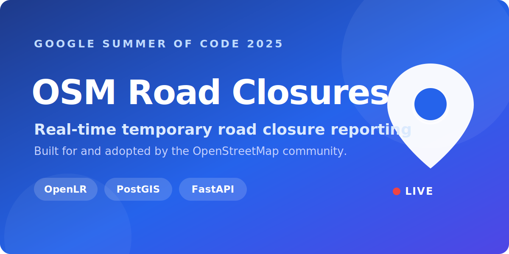
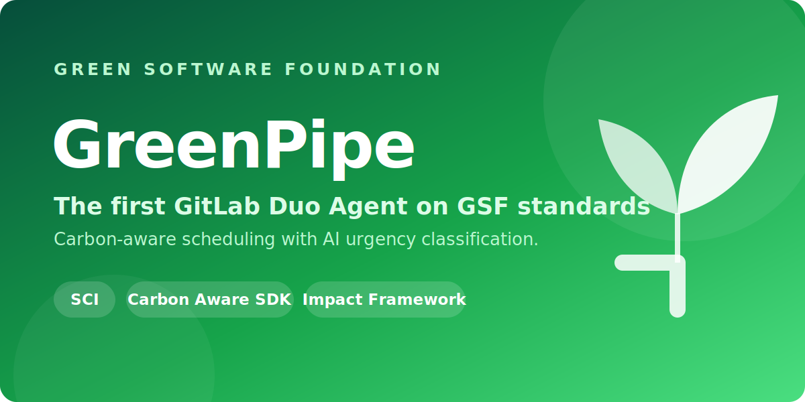
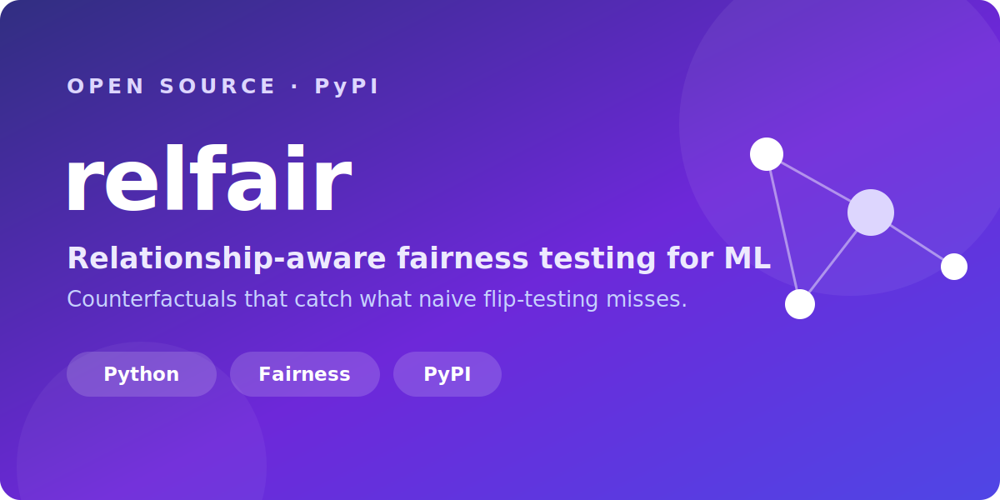
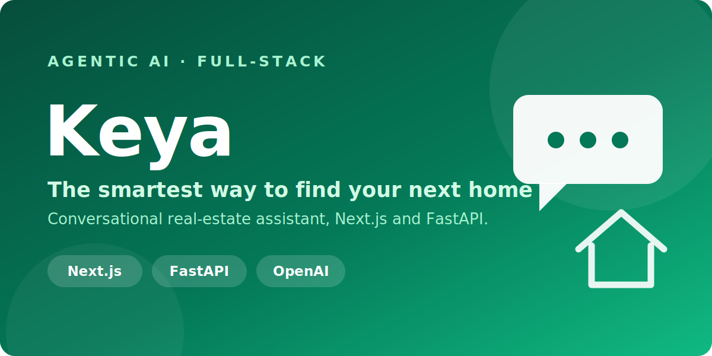
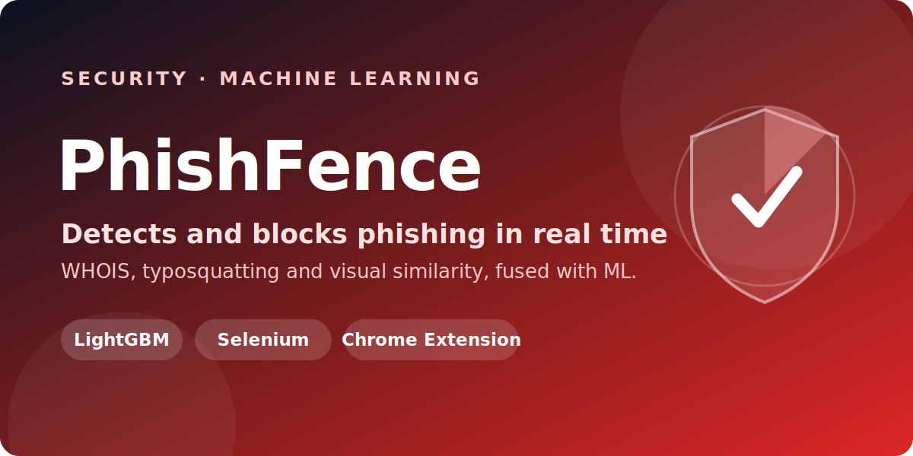
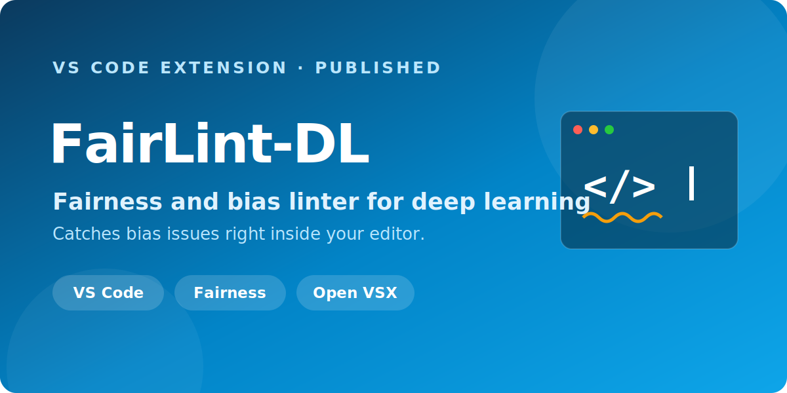
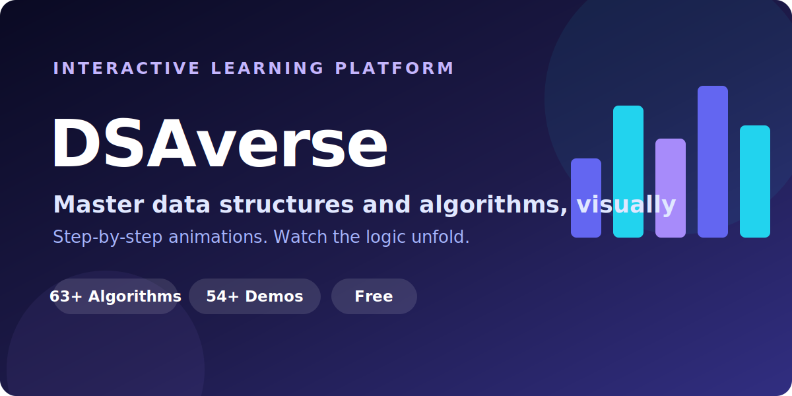

### I build scalable, cloud-native systems, and I make sure they're fair.

**MS Computer Science @ University of Illinois Chicago** &nbsp;·&nbsp; **Google Summer of Code 2025** &nbsp;·&nbsp; **Research Assistant, UIC Urban Transportation Center**

 

 

-16A34A?style=for-the-badge)

## The short version

<table>
<tr>
<td width="64%" valign="top">

I'm a software engineer and researcher drawn to problems that sit at the intersection of **scale** and **responsibility**.

Over the past few years I've shipped a **Google Summer of Code API now used by the OpenStreetMap community**, built the **first GitLab Duo Agent implementing Green Software Foundation standards**, engineered **data pipelines for large-scale behavioral simulations**, and researched how to **debug fairness in machine-learning models** and **mitigate misinformation on YouTube**. I move comfortably across the whole stack, from React/Next.js front-ends to FastAPI services, cloud infrastructure, and the ML models in between.

My focus right now: **Responsible AI, algorithmic fairness, geospatial data systems, and full-stack microservices.** I care about systems that are not just fast and scalable, but accountable.

When I'm not building, I'm usually reading, traveling somewhere new, or lost in a logic puzzle or a quant-finance rabbit hole. An introvert who's genuinely easy to talk to, so say hi.

</td>
<td width="36%" valign="top">

&#9654;&nbsp;<a href="https://github.com/Archit1706/Archit1706/raw/main/assets/intro-video.mp4">Watch with sound</a>

</td>
</tr>
</table>

> **I'm actively looking for full-time Software Engineering, AI/ML, and Full-Stack roles starting in 2026.** &nbsp; [Let's talk](https://www.archit-rathod.vercel.app/#contact)

---

## What I'm working on now

- **Research Assistant** at the **Urban Transportation Center, UIC**, building data systems for urban mobility research.
- **Completed Google Summer of Code 2025**, a Temporary Road Closures API and Database for OpenStreetMap.
- **Engineering data pipelines** for large-scale behavioral simulations, and researching misinformation mitigation on YouTube.
- **Currently focused on** ML fairness debugging, causal analysis, geospatial systems, and full-stack microservices.

---

## Tech I work with

  

<b>The full stack, by category</b>

 

**Languages**

**Machine Learning & Data**

**Frameworks & Tools**

**Cloud & DevOps**

-2088FF?style=for-the-badge&logo=githubactions&logoColor=white)

**Databases**

**Geospatial**

## Featured work

> A highlight reel. The full archive of 40+ projects across AI/ML, web, Python, and Java is in the collapsible sections below.

<table>
<tr>
<td width="50%" valign="top">

 

</td>
<td width="50%" valign="top">

 

</td>
</tr>
<tr>
<td width="50%" valign="top">

 

</td>
<td width="50%" valign="top">

 

</td>
</tr>
<tr>
<td width="50%" valign="top">

 

</td>
<td width="50%" valign="top">

 

</td>
</tr>
<tr>
<td width="50%" valign="top">

 

</td>
<td width="50%" valign="top">

 

</td>
</tr>
</table>

---

## The full archive

<b>AI Agents and Skills</b> &nbsp;

 

| Agent / Skill Set | What it is                                                                                                                                                                | Repo                                                |
| ----------------- | ------------------------------------------------------------------------------------------------------------------------------------------------------------------------- | :-------------------------------------------------: |
| FairGuard         | Reusable Claude Code Agent Skills for investigative journalism, plus findings on 1M+ federal lobbying records and congressional press releases (2022-Q1 2026). Northwestern GAIN Challenge. | [link](https://github.com/Archit1706/fair-guard) |

<b>Open Source</b> &nbsp;

 

| Web / App                                |                 Demo                  |                              Contribute                              |
| ---------------------------------------- | :-----------------------------------: | :------------------------------------------------------------------: |
| Green Pipe                               |                  [-]()                |          [link](https://github.com/Archit1706/green-pipe)            |
| FairLint-DL VSCode Extension             |[link](https://open-vsx.org/extension/fairness-tools/fairlint-dl)|  [link](https://github.com/Archit1706/FairLint-DL) |
| Temporary Road Closures API and Database |    [link](https://closures.osm.ch)    | [link](https://github.com/Archit1706/temporary-road-closures#readme) |
| DSAverse                                 | [link](https://dsa-verse.vercel.app/) |            [link](https://github.com/Archit1706/DSAverse)            |
| DSA-30                                   |   [link](https://dsa30.vercel.app/)   |         [link](https://github.com/Archit1706/DSA-30/#readme)         |

<b>AI / ML Web Apps</b> &nbsp;

 

| Web App              | Front End             | Back End (Server / Database)                  | ML (Model / Dataset / Library)                              |                    Live Demo                    |                           Repo                           |
| -------------------- | --------------------- | --------------------------------------------- | ----------------------------------------------------------- | :-----------------------------------------------: | :-----------------------------------------------------: |
| Real Estate AI       | Next.js, Tailwind CSS | Fast API, SerpAPI, Zillow API, Google Cloud Run | Hugging Face, OpenAI                                      |    [link](https://cs532-project.vercel.app/)      |  [link](https://github.com/Archit1706/cs532-project)  |
| Multi Document Agent | Next.js, Tailwind CSS | Fast API                                      | Llama Index, OpenAI                                         |    [link](https://multi-doc-agent.vercel.app/)    |  [link](https://github.com/Archit1706/multi-doc-agent)  |
| FitSphere            | Next.js, Tailwind CSS | Fast API, MongoDB, Node.js                    | OpenCV, OpenAI                                              |        [link](https://fitsphere.vercel.app/)        |      [link](https://github.com/Archit1706/FitSphere)      |
| Ascend AI            | Next.js, Tailwind CSS | Fast API, MongoDB                             | OpenCV, Transformers, OpenAI, Librosa                       |      [link](https://ascend-ai-mpr.vercel.app/)      |      [link](https://github.com/Archit1706/AscendAI)       |
| PhishiFence          | Next.js, Tailwind CSS | Fast API, WhoisDB, Chrome Extension, Selenium | OpenCV, Transformers, OpenAI, LightGBM                      |       [link](https://phish-fence.vercel.app/)        |    [link](https://github.com/Archit1706/PhishFence)     |
| SwarBhaav            | Next.js, Tailwind CSS | MongoDB, Fast API, Node.js                    | Librosa, Transformers, OpenAI                               |        [link](https://swarbhaav.vercel.app/)        |      [link](https://github.com/Archit1706/SwarBhaav)      |
| Attire AI            | Next.js, Tailwind CSS | Flask                                         | Langchain, Stable Diffusion, NLTK, Llama                    |        [link](https://attire-ai.vercel.app/)        |      [link](https://github.com/Archit1706/Attire-AI)      |
| Reflections          | Next.js, Tailwind CSS | MongoDB, Fast API, Prisma                     | BERT, NLP, Recommender, Summarizer                          |   [link](https://reflections-blog.vercel.app/)    | [link](https://github.com/Archit1706/Reflections-Blogs) |
| Home Ginie           | Next.js, Tailwind CSS | Fast API                                      | Linear Regressor, US Housing Dataset                        |       [link](https://home-ginie.vercel.app/)        |    [link](https://github.com/Archit1706/Home-Ginie)     |
| The One Finder       | Next.js, Tailwind CSS | MongoDB, Fast API, Node.js                    | Recommender                                                 |    [link](https://the-one-finder.vercel.app/)     |  [link](https://github.com/Archit1706/The-One-Finder)   |
| Social Vision        | Next.js, Tailwind CSS | MongoDB, Fast API                             | Recommender, WordCloud, Sentiment Analysis, Twitter Dataset | [link](https://network-analysis-weld.vercel.app/) |   [link](https://github.com/Archit1706/SocialVision)    |

<b>Web Projects</b> &nbsp;

 

| Web App                 | Front End                              | Back End                              |                           Live Demo                           |                                 Repo                                 |
| ----------------------- | -------------------------------------- | ------------------------------------- | :----------------------------------------------------------: | :---------------------------------------------------------------------: |
| Chatzy                  | Next.js, Tailwind CSS, Typescript      | Express.js, Node.js, DiceBear API     |            [link](https://chatzy-4x9n.onrender.com)            |               [link](https://github.com/Archit1706/Chatzy)                |
| RealEstate360           | Next.js, Tailwind CSS, Grunt, Three.js | MongoDB, Cloudinary, Node.js, FastAPI |          [link](https://realestate360.vercel.app/)           |            [link](https://github.com/Archit1706/RealEstate360)            |
| Bid Bazaar              | Next.js, Tailwind CSS                  | MongoDB, Cloudinary, Node.js, Flask   |             [link](https://bid-bazaar.vercel.app/)             |          [link](https://github.com/Archit1706/TIAA-Hackathon)           |
| Coupon Vault            | Next.js, Tailwind CSS                  | MongoDB, Fast API, Node.js            |            [link](https://coupon-vault.vercel.app/)            |            [link](https://github.com/Archit1706/Coupon-Vault)             |
| Power Up                | React, Tailwind CSS                    | Node.js, MongoDB, API's               |            [link](https://powerup.sidd065.repl.co/)            |               [link](https://github.com/Archit1706/PowerUp)               |
| First Paper             | Next.js, Tailwind CSS                  | ArXiv Dataset                         |            [link](https://first-paper.vercel.app/)             |             [link](https://github.com/Archit1706/First-Paper)             |
| Moviescape              | React, Tailwind CSS                    | TMDB                                  |            [link](https://moviescape.netlify.app/)             |              [link](https://github.com/Archit1706/Movie-App)              |
| Edu-Sys                 | React, Tailwind CSS                    | Node.js, MongoDB                      |            [link](https://edusys-tsec.vercel.app/)             |          [link](https://github.com/Archit1706/EduSys-Frontend)          |
| Healthy Me!             | React, Tailwind CSS                    | Node JS, MongoDB                      |                              -                               | [link](https://github.com/Archit1706/Codeissance_22_Keyboard-Interrupt) |
| To Do App               | React, CSS                             | Node.js, MongoDB                      |      [link](https://calm-profiterole-70f2a5.netlify.app/)      |              [link](https://github.com/Archit1706/Todo-App)               |
| Emoji Nation            | React, CSS                             | API                                   |          [link](https://emoji-nation.netlify.app/)           |            [link](https://github.com/Archit1706/Emoji-Nation)             |
| Daily Newsletter Signup | HTML, CSS, Bootstrap, JS               | Node.js                               |      [link](https://salty-hollows-02401.herokuapp.com/)      |      [link](https://github.com/Archit1706/Daily-Newsletter-Signup)      |
| Personal Blog           | HTML, CSS, JS                          | Node.js (Express, EJS)                |      [link](https://personal-blog.architrathod1.repl.co/)      |            [link](https://github.com/Archit1706/Personal-Blog)            |
| Weather Today           | HTML, CSS, JS                          | Node.js                               |      [link](https://weather-today.architrathod1.repl.co/)      |            [link](https://github.com/Archit1706/Weather-Today)            |
| Simon Game              | HTML, CSS, JS                          | -                                     |      [link](https://archit1706.github.io/The-Simon-Game/)      |          [link](https://github.com/Archit1706/The-Simon-Game)           |
| Image Gallery App       | HTML, CSS, JS                          | LocalStorage                          |        [link](https://image-gallery-upload.vercel.app/)        |         [link](https://github.com/Archit1706/Image-Gallery-App)         |
| Random Quote Generator  | HTML, CSS, JS                          | -                                     | [link](https://archit1706.github.io/Random-Quote-Generator/) |      [link](https://github.com/Archit1706/Random-Quote-Generator)       |
| Simple Calculator       | HTML, CSS, JS, jQuery                  | -                                     |   [link](https://archit1706.github.io/Simple-Calculator/)    |         [link](https://github.com/Archit1706/Simple-Calculator)         |

<b>Python Projects</b> &nbsp;

 

| Python App               | Concept / Libraries Used |                                Demo                                |                                Repo                                |
| ------------------------ | ------------------------ | :----------------------------------------------------------------: | :--------------------------------------------------------------------: |
| Background Image Remover | Flask, HTML, Rembg       |                                [-]()                               |             [link](https://github.com/Archit1706/BG-Remover)             |
| Cold Emailing            | Flask, HTML              |        [link](https://cold-emailing.architrathod1.repl.co/)        |          [link](https://github.com/Archit1706/Cold-Emailing)           |
| GRE Words App            | OOPS, Pandas, Tkinter    |    [link](https://replit.com/@ArchitRathod1/GRE-Words-Practice)    |        [link](https://github.com/Archit1706/GRE-Words-Practice)        |
| Pong Game                | OOPS, Tkinter            |        [link](https://replit.com/@ArchitRathod1/Pong-Game)         |             [link](https://github.com/Archit1706/Pong-Game)              |
| Indian States Game       | Tkinter, Pandas          |    [link](https://replit.com/@ArchitRathod1/India-States-Game)     |        [link](https://github.com/Archit1706/India-States-Game)         |
| Snake Game               | OOPS, Tkinter            |        [link](https://replit.com/@ArchitRathod1/Snake-Game)        |             [link](https://github.com/Archit1706/SnakeGame)              |
| Pomodoro Technique Timer | Tkinter                  | [link](https://replit.com/@ArchitRathod1/Pomodoro-Technique-Timer) |      [link](https://github.com/Archit1706/Pomodoro-Technique-Timer)      |
| Proctor It!              | OpenCV, Tkinter, MySQL   |                                 -                                  | [link](https://github.com/Archit1706/PROCTOR_IT-A-Virtual-Invigilator) |
| Mail Merger              | File Handling            |                              [link]()                              |            [link](https://github.com/Archit1706/Mail-Merger)             |
| NATO Alphabet Generator  | Pandas                   |                                 -                                  |      [link](https://github.com/Archit1706/NATO-Phonetics-Generator)      |
| Hirst Painting           | Tkinter                  |      [link](https://replit.com/@ArchitRathod1/Hirst-Painting)      |          [link](https://github.com/Archit1706/Hirst-Painting)          |

<b>Java Project</b> &nbsp;

 

| Desktop App                | Concept / Libraries Used |                                        Repo                                        |
| -------------------------- | ------------------------ | :--------------------------------------------------------------------------------: |
| Electricity Billing System | Java Swing               | [link](https://github.com/Archit1706/Electricity-Billing-System-Mini-Project-Sem3) |

> [!NOTE]
> Some deployed projects have broken backends because the paid services behind them are no longer running. The code tells the full story, and I'm happy to walk through any of it.

## By the numbers

 

 

## Let's connect

 

**Open to Software Engineering, AI/ML, and Full-Stack roles starting 2026. Let's build something that matters.**

